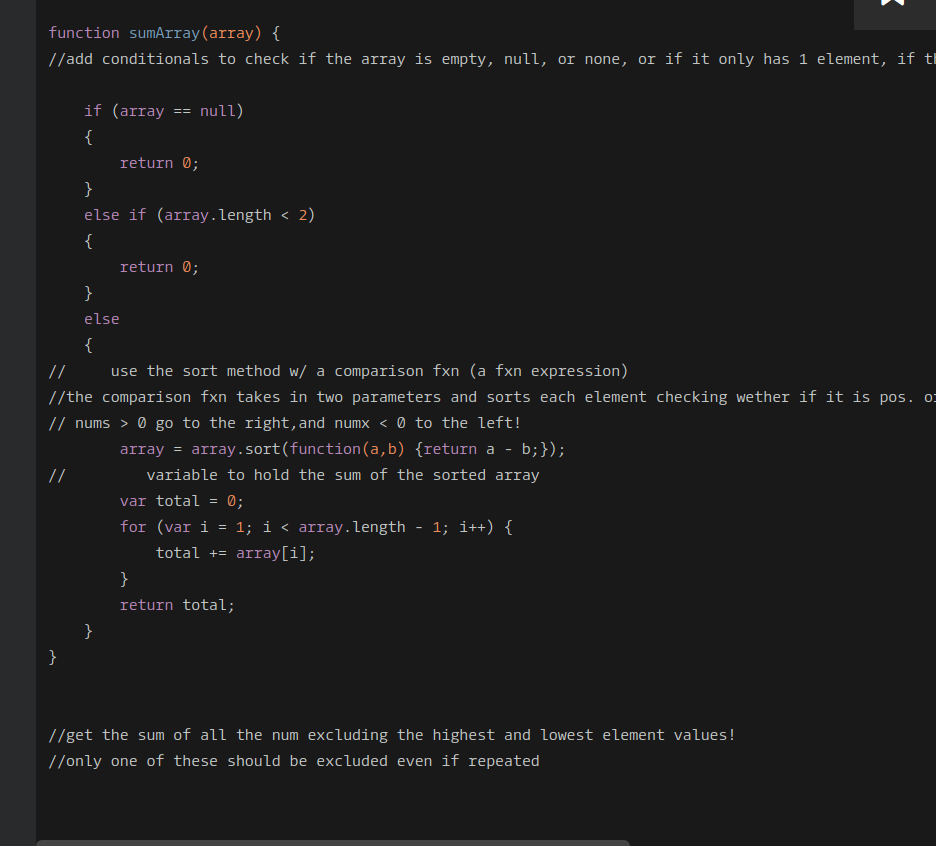

## CodeWars Challenge- 6

Sum all the numbers of the array (in F# and Haskell you get a list) except the highest and the lowest element (the value, not the index!).
(The highest/lowest element is respectively only one element at each edge, even if there are more than one with the same value!)

*Examples Given:*

1. { 6, 2, 1, 8, 10 } => 16
2. { 1, 1, 11, 2, 3 } => 6

If array is empty, null or None, or if only 1 Element exists, return 0.

Note:In C++ instead null an empty vector is used. In C there is no null. ;-)

## Solved Using:

1. JavaScript

## My solution:

Based on the conditionals provided in the instructions I immediately knew I would need and if else statement to check for the an empty array, or an array with a null value, as well as check that the array has more than one element, if either of these cases are true the function returns 0.

Otherwise, the actual work begins ;)

I set the array equal to the array that has been sorted.
I've been exposing myself to more methods in JavaScript, and while I've used the sort method before, this time I implemented it along with a function expression, in this case a comparison function. the comparison function takes in two parameters, these could be zebra,party, however, for simplicity in my case, I left these as (a,b). The comparison function returns a - b, where a is the number most left and b is the number next to it. If the number returned if positive, or the number is greater than 0 it goes to the right, if it is negative, or less than 0, it gets sorted to the left, and so on until the entire array has been sorted.  Now the array returned has been sorted in an ascending order, from lowest to highest! *(this is so cool!)*

The variable total will hold the sum of the numbers being passed into our function, when we loop through we can fulfill the last conditions left to meet, the highest and lowest numbers can not be included in our sum. By starting the loop with i at the position of 1 we automatically drop the 1st number, and since our array has been sorted in an ascending fashion this is the lowest number. Now that the lowest is gone I take care of the highest number by ending the loop at the array's length minus one, dropping the last number (our highest number) & BOOM! The loop skips the lowest and highest numbers while adding the rest of the numbers in the array and then returns the sum, being held in our variable total.
